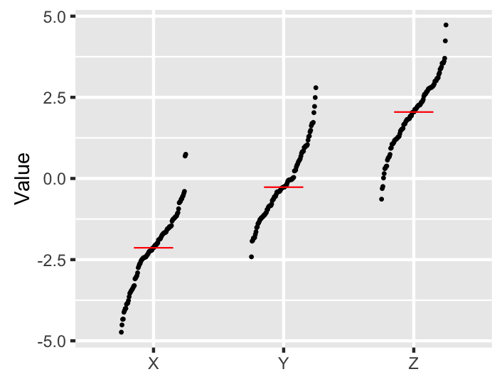
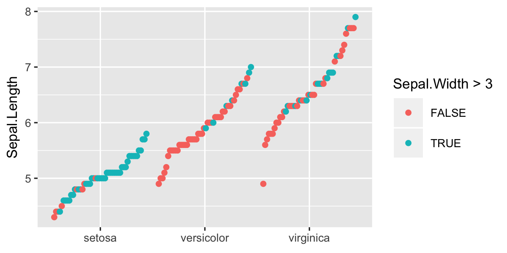

# geomsort
An ggplot2 extension for drawing figures like below. Points in each category are sorted by their y-coordinates to reduce the overlaps and enhance visibility.



The motivation of this package is to facilitate drawing figures like Fig. 1 of the following paper.

Lawrence et al., Mutational heterogeneity in cancer and the search for new cancer-associated genes. *Nature* 499, 214–218 (2013) [doi:10.1038/nature12213] (https://dx.doi.org/10.1038/nature12213)

##Installation
```
install.packages("devtools")  
devtools::install_github("msfuji/geomsort")
````

##Usage
